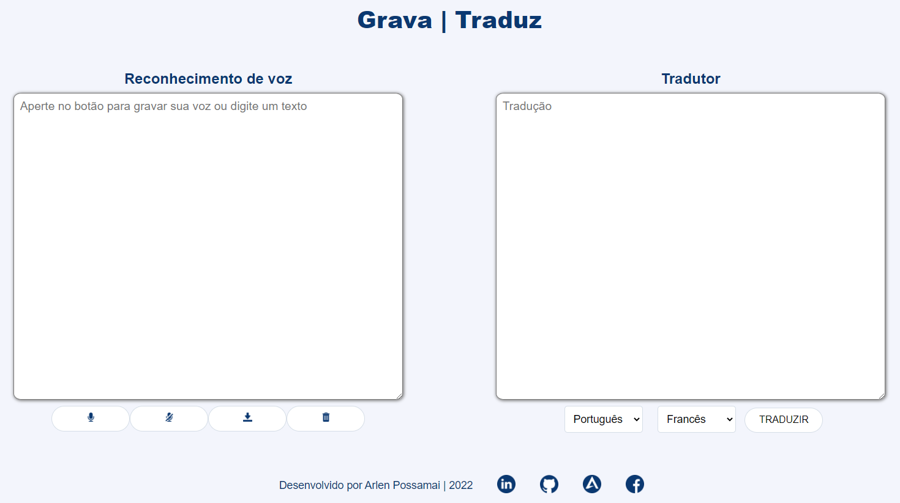

<!-- About the project -->

 
  

  &#xa0;

<h1 align="center">Record and translate</h1>

  
  &nbsp
  
  &nbsp
  
  &nbsp
  
  &nbsp

  <a href="#dart-about">About</a> &#xa0; | &#xa0; 
  <a href="#rocket-technologies">Technologies</a> &#xa0; | &#xa0;
  <a href="#computer-installation">Installation</a> &#xa0; | &#xa0;
  <a href="#memo-license">License</a> &#xa0; | &#xa0;
  <a href="#v-credits">Credits</a> &#xa0; | &#xa0;
  <a href="#pencil2-author">Author</a>

 

## :dart: About ##

This project is a part of a system developed for professionals who need to record patient notes in audio and later make this content available in text in a patient file. 
Allows voice or text input and text output with translation. 
It can be used for notes and anamnesis of patients of a physiotherapist for example.

## :rocket: Technologies ##

- HTML
- CSS
- JavaScript

## :computer: Installation ##

You can use it by clicking [HERE](https://arlendev.github.io/gravador-tradutor/) or you can download the zipped project.

## :memo: License ##

This project is under MIT license. See the [LICENSE](LICENSE) file for more details.

## :v: Credits ##

Partial credits [William Lucas](https://github.com/WilliamDosSantos)

## :pencil2: Author ##

  

<a href="#top">Back to top</a>
